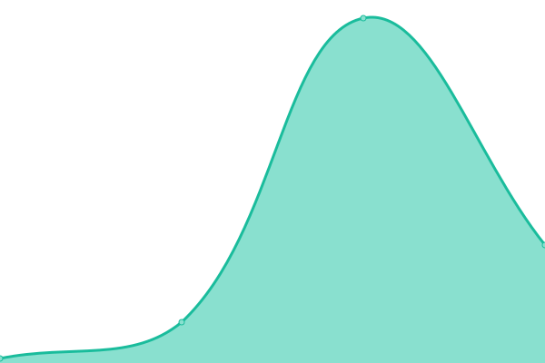

# [📈 Live Status](https://chargingthefuture.github.io/status): <!--live status--> **🟥 Complete outage**

This repository contains the open-source uptime monitor and status page for [Charging The Future](app.chargingthefuture.com), powered by [Upptime](https://github.com/upptime/upptime).

With [Upptime](https://upptime.js.org), you can get your own unlimited and free uptime monitor and status page, powered entirely by a GitHub repository. We use [Issues](https://github.com/chargingthefuture/status/issues) as incident reports, [Actions](https://github.com/chargingthefuture/status/actions) as uptime monitors, and [Pages](https://chargingthefuture.github.io/status) for the status page.

<!--start: status pages-->
<!-- This summary is generated by Upptime (https://github.com/upptime/upptime) -->
<!-- Do not edit this manually, your changes will be overwritten -->
<!-- prettier-ignore -->
| URL | Status | History | Response Time | Uptime |
| --- | ------ | ------- | ------------- | ------ |
|  [Main Platform](https://app.chargingthefuture.com/api/health) | 🟥 Down | [main-platform.yml](https://github.com/chargingthefuture/status/commits/HEAD/history/main-platform.yml) | 

 1811ms
     
 | 

<a href="https://chargingthefuture.github.io/status/history/main-platform">0.00%</a>
    

|  [ChatGroups](https://app.chargingthefuture.com/api/health/chatgroups) | 🟥 Down | [chat-groups.yml](https://github.com/chargingthefuture/status/commits/HEAD/history/chat-groups.yml) | 

 21ms
     
 | 

<a href="https://chargingthefuture.github.io/status/history/chat-groups">0.00%</a>
    

|  [Directory](https://app.chargingthefuture.com/api/health/directory) | 🟥 Down | [directory.yml](https://github.com/chargingthefuture/status/commits/HEAD/history/directory.yml) | 

 10ms
     
 | 

<a href="https://chargingthefuture.github.io/status/history/directory">0.00%</a>
    

|  [GentlePulse](https://app.chargingthefuture.com/api/health/gentlepulse) | 🟥 Down | [gentle-pulse.yml](https://github.com/chargingthefuture/status/commits/HEAD/history/gentle-pulse.yml) | 

 11ms
     
 | 

<a href="https://chargingthefuture.github.io/status/history/gentle-pulse">0.00%</a>
    

|  [Chyme](https://app.chargingthefuture.com/api/health/chyme) | 🟥 Down | [chyme.yml](https://github.com/chargingthefuture/status/commits/HEAD/history/chyme.yml) | 

 19ms
     
 | 

<a href="https://chargingthefuture.github.io/status/history/chyme">0.00%</a>
    

|  [Workforce Recruiter](https://app.chargingthefuture.com/api/health/workforce-recruiter) | 🟥 Down | [workforce-recruiter.yml](https://github.com/chargingthefuture/status/commits/HEAD/history/workforce-recruiter.yml) | 

 16ms
     
 | 

<a href="https://chargingthefuture.github.io/status/history/workforce-recruiter">0.00%</a>
    

|  [LightHouse](https://app.chargingthefuture.com/api/health/lighthouse) | 🟥 Down | [light-house.yml](https://github.com/chargingthefuture/status/commits/HEAD/history/light-house.yml) | 

 12ms
     
 | 

<a href="https://chargingthefuture.github.io/status/history/light-house">0.00%</a>
    

|  [LostMail](https://app.chargingthefuture.com/api/health/lostmail) | 🟥 Down | [lost-mail.yml](https://github.com/chargingthefuture/status/commits/HEAD/history/lost-mail.yml) | 

 10ms
     
 | 

<a href="https://chargingthefuture.github.io/status/history/lost-mail">0.00%</a>
    

|  [MechanicMatch](https://app.chargingthefuture.com/api/health/mechanicmatch) | 🟥 Down | [mechanic-match.yml](https://github.com/chargingthefuture/status/commits/HEAD/history/mechanic-match.yml) | 

 9ms
     
 | 

<a href="https://chargingthefuture.github.io/status/history/mechanic-match">0.00%</a>
    

|  [CompareNotes](https://app.chargingthefuture.com/api/health/research) | 🟥 Down | [compare-notes.yml](https://github.com/chargingthefuture/status/commits/HEAD/history/compare-notes.yml) | 

 9ms
     
 | 

<a href="https://chargingthefuture.github.io/status/history/compare-notes">0.00%</a>
    

|  [SocketRelay](https://app.chargingthefuture.com/api/health/socketrelay) | 🟥 Down | [socket-relay.yml](https://github.com/chargingthefuture/status/commits/HEAD/history/socket-relay.yml) | 

 8ms
     
 | 

<a href="https://chargingthefuture.github.io/status/history/socket-relay">0.00%</a>
    

|  [SupportMatch](https://app.chargingthefuture.com/api/health/supportmatch) | 🟥 Down | [support-match.yml](https://github.com/chargingthefuture/status/commits/HEAD/history/support-match.yml) | 

 10ms
     
 | 

<a href="https://chargingthefuture.github.io/status/history/support-match">0.00%</a>
    

|  [TrustTransport](https://app.chargingthefuture.com/api/health/trusttransport) | 🟥 Down | [trust-transport.yml](https://github.com/chargingthefuture/status/commits/HEAD/history/trust-transport.yml) | 

 15ms
     
 | 

<a href="https://chargingthefuture.github.io/status/history/trust-transport">0.00%</a>
    

<!--end: status pages-->

[**Visit our status website →**](https://chargingthefuture.github.io/status)

## 📄 License

- Powered by: [Upptime](https://github.com/upptime/upptime)
- Code: [MIT](./LICENSE) © [Anand Chowdhary](https://anandchowdhary.com), supported by [Pabio](https://pabio.com)
- Data in the `./history` directory: [Open Database License](https://opendatacommons.org/licenses/odbl/1-0/)
